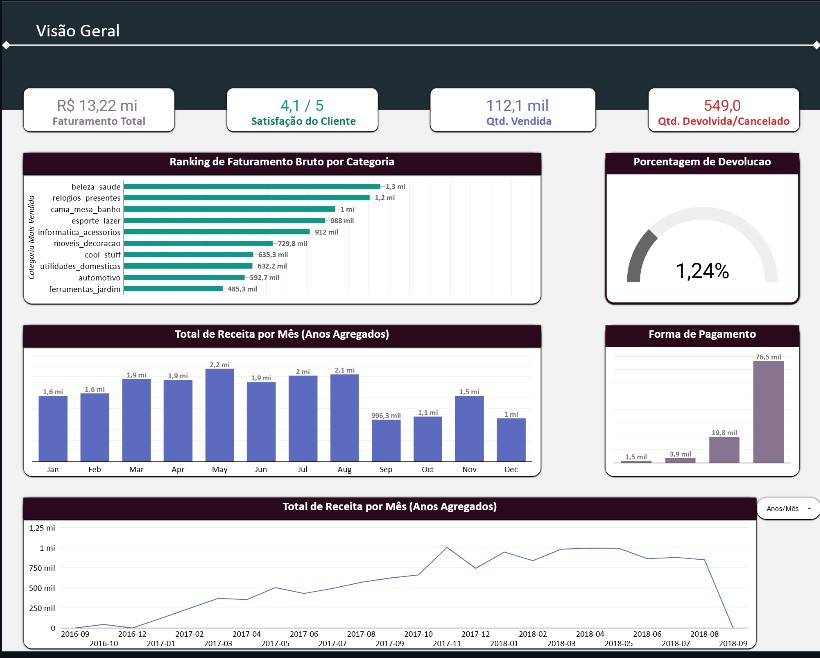

# 🛍️ E-commerce Olist — Análise e Estratégia de Crescimento

> “Entre números e insights, encontramos histórias que guiam decisões.”  

Projeto desenvolvido no **Programa Desenvolve 2025** com o objetivo de analisar o desempenho de vendas do e-commerce **Olist**, traduzindo dados em estratégias de crescimento sustentável.

---

## 🚀 Visão Geral do Projeto

O projeto teve como foco **explorar e interpretar os dados do Olist** um marketplace brasileiro para gerar insights sobre:
- 📊 Performance de vendas  
- 👥 Comportamento do consumidor  
- 💬 Satisfação dos clientes  
- 🚚 Eficiência logística  

A análise foi realizada com base em mais de **1,5 milhão de registros**, cobrindo o período de **2016 a 2018**.

---

## 📊 Visão Geral do Dashboard

Abaixo está a visão geral do dashboard criado no **Looker Studio**, com os principais indicadores de desempenho:  

**Principais KPIs monitorados:**
- 💰 Faturamento Total  
- 📦 Quantidade Vendida  
- 🔁 Taxa de Devolução  
- ⭐ Satisfação Média dos Clientes  
- 💳 Distribuição de Formas de Pagamento  

Esses indicadores foram essenciais para entender os padrões de crescimento, satisfação e comportamento do cliente ao longo do tempo.

---

## 🧠 Metodologia

| Etapa | Descrição |
|-------|------------|
| **Coleta de Dados** | Dataset “Brazilian E-Commerce by Olist” disponível no [Kaggle](https://www.kaggle.com/olistbr/brazilian-ecommerce).  |
| **Limpeza** | Remoção de duplicatas, pedidos sem aprovação e produtos inválidos. |
| **Transformação** | Estruturação em **BigQuery** com **SQL**, aplicando joins, agregações e CTEs. |
| **Visualização** | Criação de dashboard interativo no **Looker Studio**, destacando os principais KPIs. |

---

## 📈 Principais Resultados

| Indicador | Resultado |
|------------|------------|
| 💰 **Faturamento Total** | R$ **13,22 milhões** |
| 📦 **Itens Vendidos** | 112 mil |
| 🔁 **Taxa de Devolução** | 1,24% |
| ⭐ **Satisfação Média** | 4,1 / 5 |
| 💳 **Forma de Pagamento Mais Usada** | Cartão de Crédito |

---

## 🏆 Categorias com Maior Faturamento

1. 💅 **Beleza e Saúde** — categoria líder, com produtos de alta demanda e excelente margem.  
2. ⌚ **Relógios e Presentes** — forte apelo no mercado de itens especiais.  
3. 🛏️ **Cama, Mesa e Banho** — diversificação sólida do portfólio.  

Essas categorias foram o coração do faturamento, equilibrando demanda, qualidade e fidelização.

---

## 🗺️ Insights Geográficos

📍 **São Paulo** lidera com R$ **2,7 milhões** em receita, consolidando-se como o principal polo de vendas.  
Outros estados com destaque: **Rio de Janeiro**, **Curitiba** e **Belo Horizonte**.  

> **Insight:** São Paulo é o hub comercial mais relevante e serve como modelo para expansão em cidades com perfil de consumo similar.

---

## 📦 Logística e Pontualidade

- 🚛 **93,3%** das entregas foram **no prazo ou adiantadas**.  
- ⏰ **6,7%** dos pedidos tiveram **atraso** — indicando oportunidades para otimização logística.  
- 🗺️ As **10 rotas mais lentas** foram mapeadas para futuras melhorias de entrega.  

---

## 💡 Insights Estratégicos

✨ Clique para ver os principais insights

- 🎯 **Campanhas Pré-Setembro:** reforçar marketing antes da queda sazonal do último trimestre.  
- 🏅 **Incentivo a Vendedores:** premiar alta performance e engajamento.  
- 🔍 **Análise de Devoluções:** investigar causas raiz (produto, entrega ou defeitos).  
- 🧭 **Foco Geográfico:** expandir para cidades com perfil similar a São Paulo.  

---

## 🧩 Lições Aprendidas

💡 **Qualidade dos dados é tudo:** 40% do tempo foi dedicado à limpeza e validação.  
📚 **Contexto é chave:** entender o negócio é tão importante quanto dominar SQL.  
📊 **Visualizações transformam:** dashboards bem estruturados guiam decisões.  
🤝 **Colaboração multiplica resultados:** diferentes olhares criaram uma visão 360º do negócio.

---

## 🧰 Tecnologias Utilizadas

---

## 🖼️ Visualização do Projeto

📄 [Apresentação Completa (PDF)](Apresentação-Projeto-Final-Desenvolve-2025.pdf)  
📈 [Dashboard de Vendas (PDF)](Dashboard_vendas.pdf)

---

## 💬 Reflexão Final

> “Entre métricas e gráficos, descobrimos que dados não são frios —  
> são narrativas pulsando, esperando por quem saiba escutá-las.”

---

## 🔗 Conecte-se comigo

- [LinkedIn](https://linkedin.com/in/lucianaqa)

---

⭐ *Se este projeto te inspirou, não esquece de deixar uma estrela no repositório!*  
